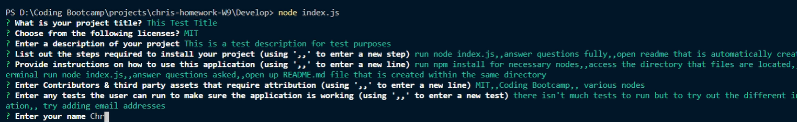
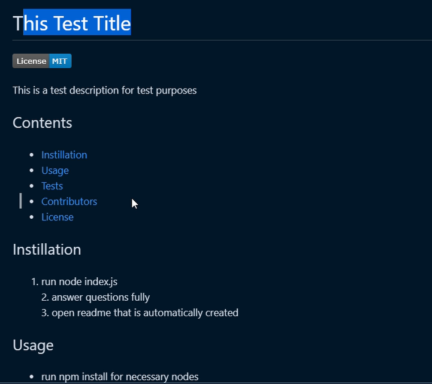

# README Markdown Generator

This application has been created to help users save time when creating projects, by generating a README file for them by asking a few questions about the project. The README file will contain necessary information that usually comes with a project when developed such as how to install it and how to run it.

## instillation

To ensure the README generator operates, you will have to run a npm install to make sure the necessary modules are installed. once installed simply enter into the 'develop' file path and run 'node index.js' in the terminal.

## Usage
When using Running within the terminal make sure you answer the questions asked and follow the instructions such as entering ',,' to enter a new line for the markdown file.

The questions asked will include:
- Title of the project
- Description of the project
- How to install the project
- How to use the project
- Contributors and third party assets used for the project
- How to test the project
- Your name
- Finally a GitHub username

## Examples

Questions asked: 

README file generated:

